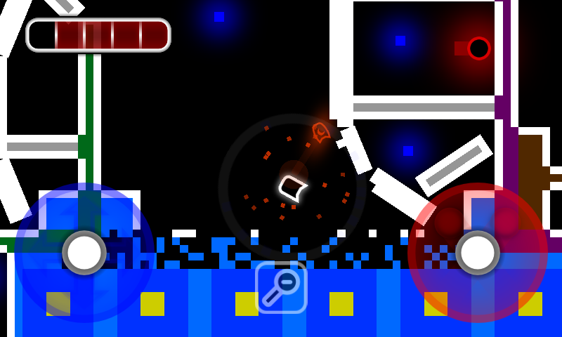

# Space challenge

- je zábavná hra na telefony s operačním systémem Windows Phone

- **Nasazená verze:** [Link na web](https://bitbucket.org/petrSin/space-challenge/)
- **Ukázka:** dole, případně v dokumentaci
- **Download:** [link na release](https://bitbucket.org/petrSin/space-challenge/)
- **Dokumentace:** [uživatelská i programátorská dokumentace](Celková dokumentace.pdf)
- **Repozitář:** [petrSin/space-challenge](https://bitbucket.org/petrSin/space-challenge/)
- **Autor:** Petr Šindelář, petr.sinde@gmail.com
- **Maturitní práce 2014/15** na [GJK](https://github.com/gjkcz/gjkcz)
- Autor nezveřejnil zdrojové kódy, pro přístup ho můžete zkusit kontaktovat.

## Dokumentace pro uživatele

### Instalace
Je třeba stáhnout Visual Studio for Windows Phone a nainstalovat framework XNA, poté stáhneme projekt z BitBucketu a spustíme ve Visual Studiu. Podrobný návod je v [dokumentaci](https://bitbucket.org/petrSin/space-challenge/src)

### Spuštění

Po otevření projektu ve Visual Studiu klikneme na Debug -> Start debuging a rozběhne se nám to buď na telefonu a nebo v emulátoru na počítači (záleží, co jsme měli vybrané).

## Dokumentace pro programátory

Všechny úpravy je možné zaslat na BitBucket.

### Příprava dev. režimu

Po stažení projektu otevřeme hlavní složku, kde budou 2 hlavní soubory a 1 složka. Otevřeme ve Visual Studiu soubor Tank1.sln a otevře se nám celý projekt.

### Struktura kódu

Hlavní třídou je Game1. Ta obsahuje konstruktor, metodu init (ty se spustí na začátku) a dvě metody na udržení běhu herní smyčky Update a Draw. Update slouží k aktualizaci herních objektů jako je posun, změna barvy, průhlednosti, výbuchu. Draw slouží převážně k vykreslení objektů (zajišťuje funkčnost posunu obrazovky a zoomu). Vyskytuje se tu třída Table, která dělí hru na dvě části: menu a hraní. Hraní je reprezentováno třídou Level a menu třídou Menu.

## Screenshoty, obrázky

